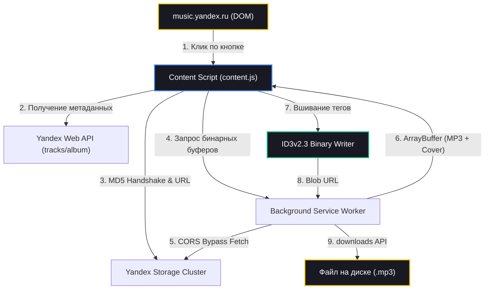

<div align="center">


# 🎵 Yandex Music Downloader (Pro Edition)

**Быстрое скачивание треков с Яндекс Музыки в MP3 (320 kbps) с автоматическим вшиванием ID3v2 тегов и обложек альбомов.**

[](https://developer.chrome.com/docs/extensions/mv3/intro/)
[](https://github.com/wwewtech/yandex-music-ext/releases)
[](LICENSE)
[](https://music.yandex.ru)

</div>

---

## ⚡ О проекте

**Yandex Music Downloader** — это современное браузерное расширение для Chromium-браузеров (Google Chrome, Яндекс Браузер, Microsoft Edge, Brave, Opera, Vivaldi), созданное с акцентом на высокую скорость, эстетику **Windows 11 Fluent Design** и максимальное качество звука.

В отличие от стандартных скриптов, расширение не только сохраняет исходный аудиопоток **320 kbps без повторного пережатия**, но и на лету генерирует полноценные бинарные **ID3v2.3 теги с вшитой HQ обложкой альбома (400x400)**. Скачанные треки корректно распознаются в автомобильных магнитолах, на смартфонах и в любых аудиоплеерах.

---

## ✨ Ключевые возможности

| Возможность | Описание |
| :--- | :--- |
| 🚀 **1-Click Download** | Интеграция кнопок скачивания в главный плеер, строчки треков в списках и всплывающее меню. |
| 🏷️ **Полные ID3v2.3 Теги** | Автоматическая запись названия (`TIT2`), исполнителей (`TPE1`), альбома (`TALB`) и года (`TYER`). |
| 🖼️ **Вшитая обложка (APIC)** | Встраивает оригинальную JPEG-обложку прямо в файл MP3. |
| 📦 **Пакетная загрузка** | Скачивание альбомов и плейлистов целиком с защитой от троттлинга. |
| 🎨 **Windows 11 Fluent UI** | Элегантный интерфейс в стиле Mica / Acrylic с тактильным откликом (8-State feedback). |
| 🔔 **Fluent InfoBar Toasts** | Неблокирующие уведомления о статусе скачивания и вшивания тегов вместо раздражающих всплывающих окон. |
| ⚙️ **Гибкие настройки** | Выбор шаблона имени файла (`Артист — Название`, `Название — Артист`, `Название`), управление тегами и уведомлениями. |
| 🛡️ **Безопасность и MV3** | Архитектура Manifest V3, работа только через текущую сессию без передачи данных на сторонние серверы. |

---

## 🏗️ Архитектура и Data Flow



---

## 📥 Установка

### Вариант 1. Готовый ZIP-архив (Рекомендуется)

1. Перейдите в раздел [**Releases**](https://github.com/wwewtech/yandex-music-ext/releases) и скачайте актуальный архив (например, `yandex-music-downloader-v1.1.0.zip`).
2. Распакуйте архив в любую постоянную папку на компьютере.
3. Откройте в браузере страницу расширений:
   - **Google Chrome / Brave / Opera**: `chrome://extensions/`
   - **Яндекс Браузер**: `browser://extensions/`
   - **Microsoft Edge**: `edge://extensions/`
4. Включите тумблер **«Режим разработчика»** (Developer mode) в правом верхнем углу.
5. Нажмите кнопку **«Загрузить распакованное расширение»** (Load unpacked).
6. Выберите распакованную папку.
7. Готово! Перейдите на [music.yandex.ru](https://music.yandex.ru) и наслаждайтесь любимой музыкой.

### Вариант 2. Установка через Git

```bash
git clone https://github.com/wwewtech/yandex-music-ext.git
cd yandex-music-ext
```
Затем загрузите распакованную папку через меню браузера `chrome://extensions/`.

---

## 🎧 Руководство пользователя

### 1. Скачивание играющего трека
- Нажмите на круглую кнопку со стрелкой в правой части нижней панели плеера (рядом с кнопкой лайка).
- Либо нажмите на иконку расширения на панели браузера и нажмите **«Скачать этот трек»**.

### 2. Скачивание треков из плейлистов и альбомов
- В строке любого трека отображается аккуратная иконка скачивания. Нажмите на нее — трек загрузится в фоне.

### 3. Пакетное скачивание (Batch Download)
- Откройте страницу любого альбома или плейлиста.
- В шапке страницы нажмите кнопку **«Скачать всё»**.
- Откроется диспетчер очереди, который последовательно и безопасно сохранит все треки.

---

## 📁 Структура репозитория

```text
yandex_music_ext/
├── .github/
│   ├── workflows/
│   │   ├── ci.yml              # Валидация схемы и синтаксиса
│   │   └── release.yml         # Автоматическая сборка релизов
│   ├── ISSUE_TEMPLATE/         # Шаблоны Bug Report и Feature Request
│   └── PULL_REQUEST_TEMPLATE.md
├── assets/
│   └── banner.png              # Официальный GitHub баннер
├── icons/
│   ├── icon.svg                # Исходный векторный логотип
│   ├── icon16.png              # Фавиконка расширения
│   ├── icon32.png
│   ├── icon48.png
│   ├── icon128.png
│   └── icon512.png
├── background.js               # Service Worker (CORS-прокси и downloads API)
├── content.js                  # Внедрение UI, перехват потока и ID3-тегирование
├── content.css                 # Стили кнопок, модальных окон и InfoBar уведомлений
├── popup.html                  # Fluent Popup интерфейс
├── popup.css                   # Стили всплывающего окна (Mica/Acrylic)
├── popup.js                    # Логика телеметрии плеера и настроек
├── id3-writer.js               # Бинарный сборщик ID3v2 фреймов
├── md5.js                      # Генерация подписи запроса к хранилищу
├── manifest.json               # Манифест расширения Manifest V3
├── CHANGELOG.md                # История изменений по версиям
├── CONTRIBUTING.md             # Руководство по разработке
├── CODE_OF_CONDUCT.md          # Кодекс поведения
├── SECURITY.md                 # Политика безопасности
├── LICENSE                     # Лицензия MIT
└── README.md                   # Главная документация
```

---

## 🛠️ Стек технологий

- **Runtime**: Vanilla JavaScript (ES6+), zero runtime dependencies.
- **Platform**: Chrome Extensions API (Manifest V3, Service Workers, `chrome.downloads`, `chrome.storage`).
- **UI Architecture**: Windows 11 Fluent Design System, Acrylic/Mica surfaces, 8-State interactive feedback.
- **Audio Processing**: ID3v2.3 Frame Builder (APIC, TIT2, TPE1, TALB, TYER), MD5 hash generation.

---

## ⚖️ Дисклеймер

Данное расширение разработано исключительно в образовательных целях и для персонального ознакомления. Все права на музыкальные произведения принадлежат их законным правообладателям и сервису Яндекс Музыка.

---

## 📄 Лицензия

Проект распространяется под свободной лицензией [MIT](LICENSE).
