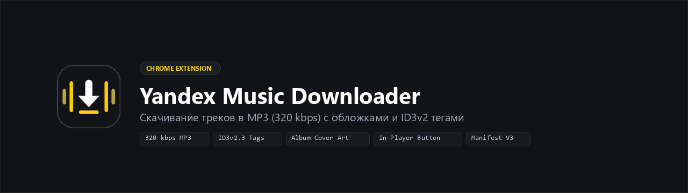

<div align="center">



<br/>

[](https://github.com/wwewtech/yandex-music-ext/releases)
[](LICENSE)
[](https://developer.chrome.com/docs/extensions/mv3/intro/)

</div>

# Yandex Music Downloader

Расширение для Chromium-браузеров (Chrome, Edge, Brave, Яндекс Браузер). Добавляет кнопку скачивания треков с Яндекс Музыки прямо в плеер и в списки треков.

**Скачивает MP3 в максимальном качестве (320 kbps), автоматически вшивает ID3v2 теги и оригинальную обложку альбома.**

---

## Установка

1. Скачайте архив из раздела [Releases](https://github.com/wwewtech/yandex-music-ext/releases) и распакуйте его.
2. Откройте страницу расширений в браузере:
   - Chrome / Brave: `chrome://extensions/`
   - Edge: `edge://extensions/`
   - Яндекс Браузер: `browser://extensions/`
3. Включите **Режим разработчика** (Developer mode).
4. Нажмите **Загрузить распакованное расширение** и выберите распакованную папку.
5. Откройте [music.yandex.ru](https://music.yandex.ru) — иконки скачивания появятся автоматически.

---

## Как пользоваться

- **Кнопка в плеере** — появляется рядом с кнопкой «Мне нравится» в нижней панели.
- **Кнопки в списках** — у каждого трека в альбоме, плейлисте или чарте.
- **Попап расширения** — нажмите на иконку в панели браузера, чтобы скачать текущий трек или изменить настройки.

Файл сохраняется в папку «Загрузки» с именем `Артист — Название.mp3`.

---

## Возможности

- **320 kbps MP3** — максимальное качество без перекодирования.
- **ID3v2.3 теги** — название, исполнитель, альбом, год.
- **Обложка альбома** — HQ JPEG 400×400, вшитая в файл (APIC).
- **Пакетное скачивание** — целые альбомы и плейлисты через диспетчер очереди.
- **Настраиваемые шаблоны** — формат имени файла, «Сохранить как...», уведомления.
- **Manifest V3** — современная архитектура Service Worker, без тяжёлых зависимостей.

---

## Архитектура

```
music.yandex.ru
  └─ content.js        ← DOM-инъекция кнопок, получение метаданных
       └─ background.js ← CORS-прокси fetch, chrome.downloads API
            └─ id3-writer.js ← бинарная сборка ID3v2.3 фреймов
```

---

## Разработка

```bash
git clone https://github.com/wwewtech/yandex-music-ext.git
# Загрузите папку через chrome://extensions/ в режиме разработчика
```

Проверка синтаксиса:
```bash
node --check background.js content.js popup.js
```

---

## Дисклеймер

Только для личного использования. Все права на контент принадлежат правообладателям и сервису Яндекс Музыка.

## Лицензия

[MIT](LICENSE)
